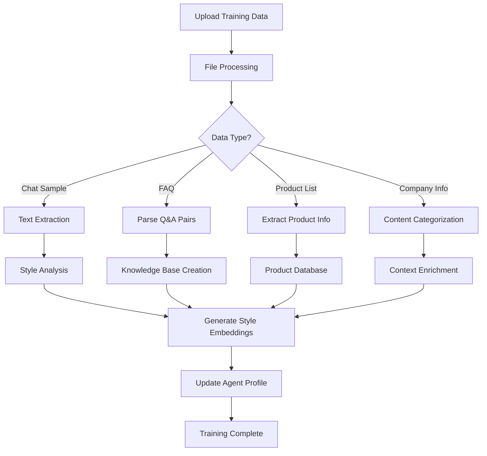

# AI Training and Market Data Integration Logic

## AI Training Process

### Overview
AI training customizes responses based on user-uploaded data. Process analyzes text patterns, creates style profiles, and generates context-aware prompts for OpenRouter API.

### Training Pipeline



### Detailed Steps

#### 1. Data Upload & Processing
- **File Types**: TXT, CSV, PDF, DOCX
- **Processing**:
  - Text extraction using libraries (pdf-parse, mammoth)
  - CSV parsing for structured data
  - Validation: File size < 10MB, supported formats

#### 2. Content Analysis
**For Chat Samples (Individuals):**
- Tokenize messages using NLTK or similar
- Extract features:
  - Sentence length distribution
  - Common phrases and slang
  - Response patterns (greetings, closings)
  - Tone analysis (sentiment, formality score)

**For FAQs (Businesses):**
- Parse question-answer pairs
- Create vector embeddings for semantic search
- Categorize by topic

**For Product Lists:**
- Extract: Name, description, price, category
- Store in structured format for price queries

**For Company Info:**
- Summarize key information
- Extract brand voice guidelines

#### 3. Style Profile Creation
- **Individuals**: Create prompt template like:
  ```
  Respond in the style of [user's name]: [extracted patterns]
  Use casual language, [common phrases]
  ```

- **Businesses**: Create knowledge-based prompts:
  ```
  You are a customer service AI for [company].
  Use this FAQ knowledge: [embedded data]
  Products: [product list]
  ```

#### 4. Integration with AI API
- For each response generation:
  - Retrieve agent profile
  - Include training data in system prompt
  - Add conversation history as context
  - Use retrieved market data if applicable

#### 5. Continuous Learning
- Log all interactions
- Periodic retraining based on new messages
- User feedback to improve models

## Market Data Integration

### Data Sources
- External APIs: e.g., Nigerian Bureau of Statistics, local market APIs
- Real-time price feeds for commodities, fuel, electronics
- Fallback to cached data if API unavailable

### Integration Logic
1. **API Calls**:
   - Scheduled updates (hourly/daily)
   - On-demand queries for specific items

2. **Caching**:
   - Store in market_data table
   - TTL: 24 hours

3. **Usage in AI**:
   - Detect price-related queries using keyword matching
   - Add current prices to prompt context:
     ```
     Current market prices (as of [date]):
     Rice: ₦500/kg
     Fuel: ₦200/liter
     ```

4. **Response Enhancement**:
   - Provide price comparisons
   - Suggest alternatives based on market data
   - Include sources for transparency

### Example AI Prompt with Market Data
```
System: You are LagosAI assistant for [user].
User has [style preferences].
Current market context: [price data]

User: How much is rice today?
Assistant: Based on current market data, rice is priced at ₦500 per kg in Lagos markets.
```

## Performance Optimization
- Pre-compute embeddings for faster retrieval
- Cache frequent queries
- Background processing for training
- Rate limiting for API calls

## Monitoring & Improvement
- Track response quality metrics
- A/B testing different prompt strategies
- User feedback collection
- Model version management