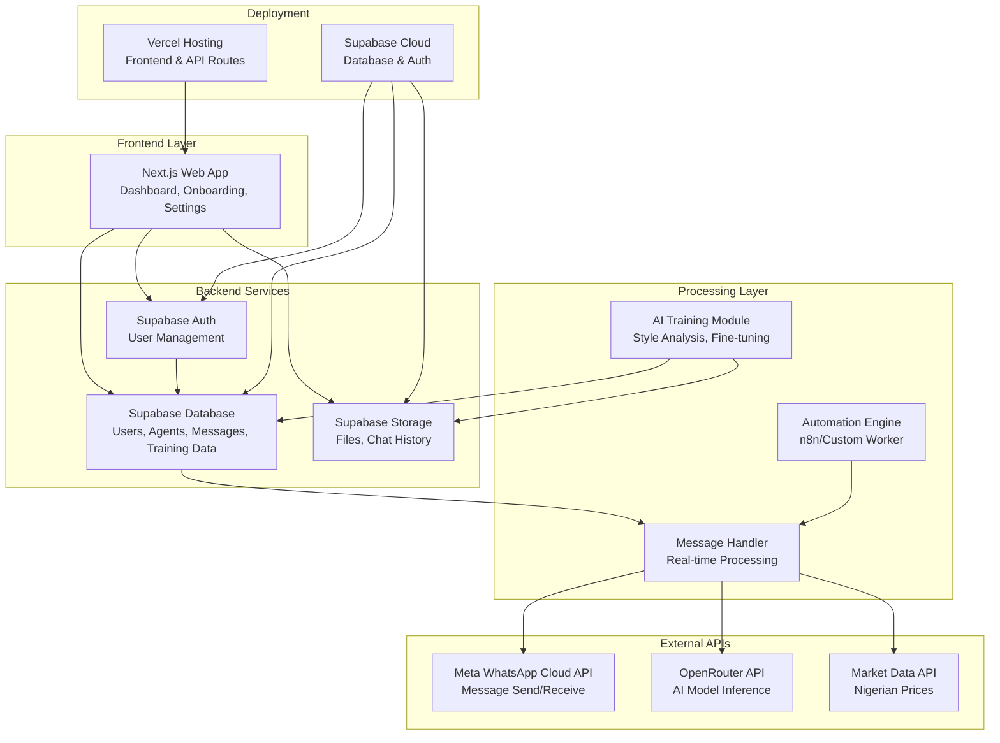

# LagosAI System Architecture

## Overview
LagosAI is a web-based WhatsApp automation platform with AI-powered conversation management. The system integrates WhatsApp Cloud API for messaging, OpenRouter for AI responses, Supabase for backend services, and a Next.js frontend.

## High-Level Architecture

## Component Descriptions

- **Frontend (Next.js)**: User interface for dashboard, onboarding, chat simulation, and settings management.
- **Supabase**: Handles authentication, database storage (PostgreSQL), and file storage.
- **WhatsApp Cloud API**: Manages sending/receiving messages, media, and webhooks.
- **OpenRouter API**: Powers AI responses using various models (GPT-4, Claude, etc.).
- **Market Data API**: Provides real-time Nigerian market prices for AI insights.
- **AI Training Module**: Processes uploaded chat data to create user-specific AI profiles.
- **Automation Engine**: Handles workflow automation for responses and follow-ups.
- **Deployment**: Vercel for frontend hosting, Supabase for backend services.

## Data Flow
1. User signs up via frontend → Supabase Auth
2. User uploads training data → Stored in Supabase Storage
3. AI training processes data → Updates user agent profile in DB
4. WhatsApp messages received → Webhook to message handler
5. Handler queries AI API → Generates response
6. Response sent via WhatsApp API → Logged in database
7. Dashboard displays analytics from DB

## Security Considerations
- End-to-end encryption for WhatsApp messages
- User data isolation
- API key management via environment variables
- Data deletion capabilities for users