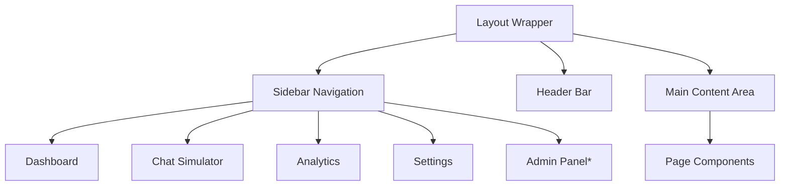

# Dashboard UI Components and Analytics Views

## Overview
The dashboard uses Next.js with Tailwind CSS for responsive design. Main layout includes sidebar navigation, header, and content area.

## Main Layout Structure

## Key Pages and Components

### 1. Main Dashboard (/dashboard)
**Stats Cards Row:**
- Total Messages (card with count and trend)
- Auto Replies (percentage and count)
- Response Time (average in seconds)
- Satisfaction Rate (based on user feedback)

**Recent Messages Table:**
- Columns: Time, Direction (in/out), Content (truncated), Status
- Pagination, filter by agent

**Performance Chart:**
- Line chart: Messages over time (last 7 days)
- Bar chart: Response times distribution

**Quick Actions:**
- "Test AI" button → redirects to simulator
- "Retrain AI" button → triggers training API
- "Add Agent" button

**Layout:** Grid layout with cards in top row, chart below, table on right.

### 2. Chat Simulator (/simulator)
**Components:**
- Agent Selector (dropdown)
- Message Input Area (textarea with send button)
- Conversation Display (chat bubbles)
- Response Settings (temperature slider, max tokens)

**Features:**
- Simulate user messages
- Display AI responses in real-time
- Save conversations for training
- Clear chat history

**Layout:** Two-column: left for input/simulator, right for settings.

### 3. Analytics Page (/analytics)
**Charts and Metrics:**
- Message Volume: Time series chart (daily/weekly/monthly)
- Response Time: Histogram showing distribution
- Error Rate: Pie chart (successful vs failed responses)
- User Engagement: Active users, session duration

**Filters:**
- Date range picker
- Agent selector
- Message type filter

**Export:** CSV/PDF export buttons

**Layout:** Full-width charts with filter bar at top.

### 4. Settings Page (/settings)
**Agent Profile Section:**
- Name, description, avatar upload
- Tone/style preferences (sliders for formality, friendliness)

**WhatsApp Configuration:**
- API key input (masked)
- Webhook URL display
- Test connection button

**Training Data:**
- Upload area for files (drag-drop)
- List of uploaded files with status (processed/not)
- Delete buttons

**Account Settings:**
- Change password
- Notification preferences
- Delete account

**Layout:** Tabbed interface (Profile, WhatsApp, Training, Account)

### 5. Admin Panel (/admin) - Admin Only
**User Management:**
- User table with search/filter
- Edit user roles, suspend accounts

**System Monitoring:**
- Active agents count
- API usage stats
- Error logs

**Layout:** Table-based with action buttons.

## UI Components Library
- **Cards:** Rounded containers with shadows
- **Buttons:** Primary (blue), secondary (gray), danger (red)
- **Forms:** Input fields, dropdowns, file uploads
- **Charts:** Using Chart.js or Recharts
- **Tables:** Sortable, paginated with search
- **Modals:** For confirmations, detailed views

## Responsive Design
- Mobile: Collapsible sidebar, stacked layout
- Tablet: Adjusted grid columns
- Desktop: Full multi-column layout

## Theme
- Primary: Blue (#3B82F6)
- Neutral: Gray tones
- Dark mode option (future enhancement)

## Accessibility
- ARIA labels for screen readers
- Keyboard navigation
- High contrast ratios
- Focus indicators