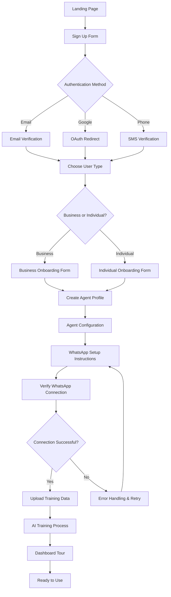

# User Authentication and Onboarding Flow

## Overview
New users go through a streamlined onboarding process to set up their AI agent. The flow handles authentication, profile creation, and initial agent configuration.

## Onboarding Flow Diagram

## Detailed Steps

### 1. Authentication
- **Signup Options**: Email/password, Google OAuth, phone number
- **Verification**: Email link, OAuth callback, SMS code
- **Session Management**: JWT tokens via Supabase Auth

### 2. User Type Selection
- **Business**: Focus on customer service, catalogs, orders
- **Individual**: Personal texting style, friends/family
- UI: Toggle buttons with descriptions

### 3. Profile Creation
**Common Fields:**
- Full name
- WhatsApp number (for agent)
- Preferred language (English, Pidgin, etc.)
- Time zone

**Business Specific:**
- Company name
- Industry
- Business hours

**Individual Specific:**
- Communication style preferences
- Sample message examples

### 4. Agent Creation
- Auto-generate agent name based on user input
- Set initial tone style (professional for business, casual for individual)
- Link to user's WhatsApp number

### 5. WhatsApp Setup
- Step-by-step guide to Meta WhatsApp Cloud API setup
- Provide API key input fields
- Test connection with sandbox mode
- Instructions for webhook URL: https://yourapp.com/api/whatsapp/webhook

### 6. Training Data Upload
- **For Businesses**: Upload product catalogs (PDF/CSV), FAQs (TXT), chat history
- **For Individuals**: Upload past chat exports, style examples
- File validation and processing
- Progress indicator for AI training

### 7. Initial Training
- Background processing of uploaded data
- Create style embedding or prompt templates
- Notify user when complete

### 8. Dashboard Introduction
- Interactive tour of main features
- Chat simulator for testing
- Quick start guide

## Error Handling
- Invalid credentials: Retry with hints
- WhatsApp setup failure: Detailed error messages and support links
- Upload failures: File size/type validation
- Network issues: Retry mechanisms with exponential backoff

## Security Considerations
- Password strength requirements
- Two-factor authentication option
- Secure storage of API keys (encrypted in database)
- Data privacy consent during onboarding